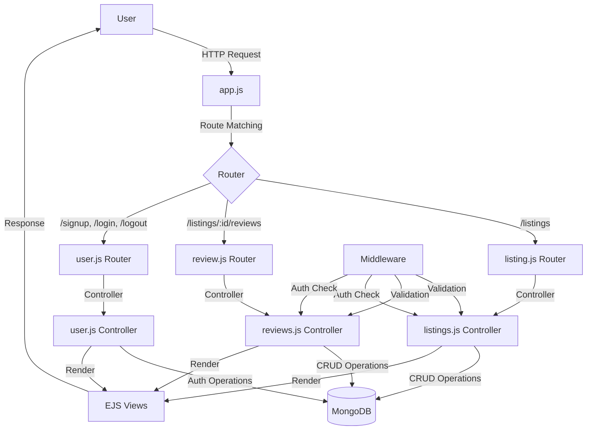
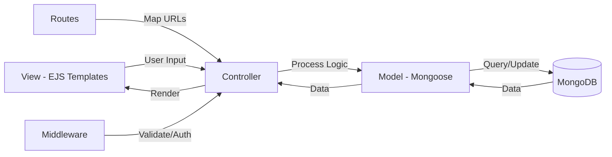
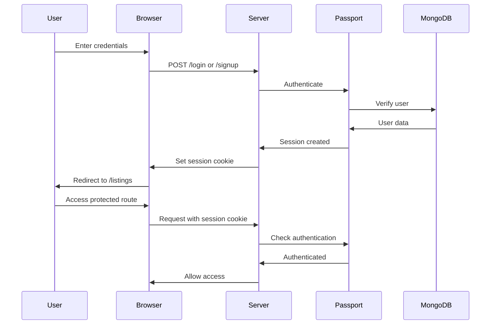
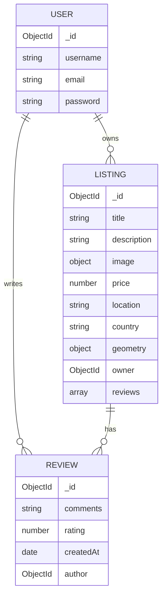

# 🏠 Mybnb - Airbnb Clone

A full-stack web application inspired by Airbnb built with Node.js, Express, MongoDB, and EJS. Users can browse listings, create accounts, add their own properties, leave reviews, and view locations on interactive maps.

## ✨ Features

- 🔐 **User Authentication** - Secure signup/login with Passport.js
- 🏡 **Property Listings** - Browse, create, edit, and delete listings
- ⭐ **Reviews & Ratings** - Add and manage property reviews
- 🗺️ **Interactive Maps** - Mapbox integration for location visualization
- 🖼️ **Image Upload** - Cloudinary integration for image storage
- 🔍 **Search Functionality** - Search listings by destination
- 🏷️ **Filters** - Filter by categories (Trending, Rooms, Beach, etc.)
- 💰 **Price Display Toggle** - Show/hide GST in pricing
- 📱 **Responsive Design** - Mobile-friendly Bootstrap UI
- 🔒 **Authorization** - Owner-only edit/delete permissions
- ✅ **Form Validation** - Client & server-side validation with Joi

## 🛠️ Tech Stack

**Backend:**
- Node.js
- Express.js
- MongoDB (Atlas & Local)
- Mongoose ODM

**Frontend:**
- EJS (Templating)
- Bootstrap 5
- CSS3
- JavaScript

**Authentication & Security:**
- Passport.js (Local Strategy)
- passport-local-mongoose
- Express Session
- connect-mongo (Session Store)
- Cookie Parser

**File Upload & Storage:**
- Multer
- Cloudinary

**Validation:**
- Joi

**Maps:**
- Mapbox GL JS
- @mapbox/mapbox-sdk

**Other:**
- connect-flash (Flash Messages)
- method-override (REST APIs)
- dotenv (Environment Variables)
- ejs-mate (Layouts)

## 📁 Project Structure

```
Airbnb/
├── app.js                      # Main application entry point
├── package.json                # Dependencies and scripts
├── .env                        # Environment variables (not in repo)
├── .gitignore                 # Git ignore file
│
├── Models/                     # Mongoose schemas
│   ├── listing.js             # Listing model with geometry
│   ├── reviews.js             # Review model
│   └── user.js                # User model with passport plugin
│
├── Routes/                     # Express route handlers
│   ├── listing.js             # Listing CRUD routes
│   ├── review.js              # Review routes
│   └── user.js                # Auth routes (signup/login/logout)
│
├── controllers/                # Business logic
│   ├── listings.js            # Listing controller methods
│   ├── reviews.js             # Review controller methods
│   └── user.js                # User controller methods
│
├── views/                      # EJS templates
│   ├── layouts/
│   │   └── boilerplate.ejs    # Main layout template
│   ├── includes/
│   │   ├── navbar.ejs         # Navigation bar
│   │   ├── footer.ejs         # Footer
│   │   └── flash.ejs          # Flash messages
│   ├── listings/
│   │   ├── index.ejs          # All listings page
│   │   ├── show.ejs           # Individual listing detail
│   │   ├── new.ejs            # Create listing form
│   │   └── edit.ejs           # Edit listing form
│   ├── users/
│   │   ├── signup.ejs         # Signup form
│   │   └── login.ejs          # Login form
│   └── error.ejs              # Error page
│
├── public/                     # Static assets
│   ├── CSS/
│   │   ├── style.css          # Main styles
│   │   ├── navbar.css         # Navbar styles
│   │   ├── listings.css       # Listing card styles
│   │   └── rating.css         # Star rating styles
│   └── js/
│       ├── map.js             # Mapbox initialization
│       ├── listings.js        # Tax toggle functionality
│       └── form-validation.js # Bootstrap form validation
│
├── utils/                      # Utility modules
│   ├── ExpressError.js        # Custom error class
│   └── wrapAsync.js           # Async error wrapper
│
├── initialization/             # Database seeding
│   ├── data.js                # Sample listing data
│   └── index.js               # Seed script
│
├── middleware.js               # Custom middleware (auth, validation)
├── schema.js                   # Joi validation schemas
└── cloudConfig.js              # Cloudinary configuration
```

## 🔄 Application Flow



## 🗺️ MVC Architecture



## 🔐 Authentication Flow



## 📊 Database Schema



## 🚀 Getting Started

### Prerequisites

- Node.js (v22.14.0 or higher)
- MongoDB (Local or Atlas)
- Cloudinary Account
- Mapbox Account

### Installation

1. **Clone the repository**
   ```bash
   git clone https://github.com/Ashu-213/Mybnb.git
   cd Mybnb
   ```

2. **Install dependencies**
   ```bash
   npm install
   ```

3. **Create `.env` file** in the root directory
   ```env
   CLOUD_NAME=your_cloudinary_cloud_name
   CLOUD_API_KEY=your_cloudinary_api_key
   CLOUD_API_SECRET=your_cloudinary_api_secret
   
   MAPBOX_TOKEN=your_mapbox_access_token
   
   ATLAS_DB=your_mongodb_atlas_connection_string
   # Or use local MongoDB (comment out ATLAS_DB)
   ```

4. **Seed the database** (Optional)
   ```bash
   node initialization/index.js
   ```

5. **Start the server**
   ```bash
   nodemon app.js
   ```

6. **Open browser**
   ```
   http://localhost:3000/listings
   ```

## 🔑 Environment Variables

| Variable | Description |
|----------|-------------|
| `CLOUD_NAME` | Cloudinary cloud name |
| `CLOUD_API_KEY` | Cloudinary API key |
| `CLOUD_API_SECRET` | Cloudinary API secret |
| `MAPBOX_TOKEN` | Mapbox public access token |
| `ATLAS_DB` | MongoDB Atlas connection string (optional) |
| `NODE_ENV` | Environment (development/production) |

## 📝 API Endpoints

### Listings
- `GET /listings` - Get all listings
- `GET /listings/new` - Render create form (auth required)
- `POST /listings` - Create new listing (auth required)
- `GET /listings/:id` - Get single listing
- `GET /listings/:id/edit` - Render edit form (owner only)
- `PUT /listings/:id` - Update listing (owner only)
- `DELETE /listings/:id` - Delete listing (owner only)

### Reviews
- `POST /listings/:id/reviews` - Add review (auth required)
- `DELETE /listings/:id/reviews/:reviewId` - Delete review (author only)

### Authentication
- `GET /signup` - Render signup form
- `POST /signup` - Register new user
- `GET /login` - Render login form
- `POST /login` - Login user
- `GET /logout` - Logout user

## 🎨 Features in Detail

### Middleware Protection
- **isLoggedIn**: Ensures user is authenticated
- **isOwner**: Verifies listing ownership
- **isReviewAuthor**: Verifies review ownership
- **joiValidateListing**: Server-side form validation
- **joiValidateReview**: Review validation

### Image Upload
- Images uploaded via Multer
- Stored in Cloudinary
- Automatic optimization and transformation

### Map Integration
- Uses Mapbox Geocoding API
- Converts location strings to coordinates
- Displays interactive map on listing detail page

### Session Management
- Sessions stored in MongoDB via connect-mongo
- 7-day expiration
- HttpOnly cookies for security

## 🐛 Known Issues & Fixes Needed

1. ❌ `public/js/map.js` line 1 - Remove `require()` statement (browser incompatible)
2. ❌ Unused imports in `Models/listing.js` and `schema.js`
3. ❌ `controllers/user.js` - Fix `req.session.returnTo` → `req.session.redirectUrl`
4. ❌ CSS: Change `width: 80vh` to `80vw` in `style.css` for map container
5. ❌ Typo: "shoud" → "should" in validation messages
6. ❌ Missing `let` in `for (info of taxInfo)` loop

## 🔮 Future Enhancements

- [ ] Search functionality backend implementation
- [ ] Category filtering system
- [ ] Booking system with calendar
- [ ] Payment integration
- [ ] User profile pages
- [ ] Wishlist/favorites feature
- [ ] Email verification
- [ ] Password reset functionality
- [ ] Admin dashboard
- [ ] Pagination for listings
- [ ] Advanced search filters (price range, amenities)
- [ ] Social media authentication (Google, Facebook)

## 🤝 Contributing

Contributions are welcome! Please follow these steps:

1. Fork the repository
2. Create a feature branch (`git checkout -b feature/AmazingFeature`)
3. Commit changes (`git commit -m 'Add AmazingFeature'`)
4. Push to branch (`git push origin feature/AmazingFeature`)
5. Open a Pull Request

## 📄 License

This project is open source and available under the [ISC License](LICENSE).

## 👤 Author

**Ashu-213**
- GitHub: [@Ashu-213](https://github.com/Ashu-213)
- Repository: [Mybnb](https://github.com/Ashu-213/Mybnb)

## 🙏 Acknowledgments

- Inspired by [Airbnb](https://www.airbnb.com)
- Built as a learning project for full-stack web development
- Thanks to the open-source community for amazing tools and libraries

---

⭐ Star this repository if you found it helpful!
